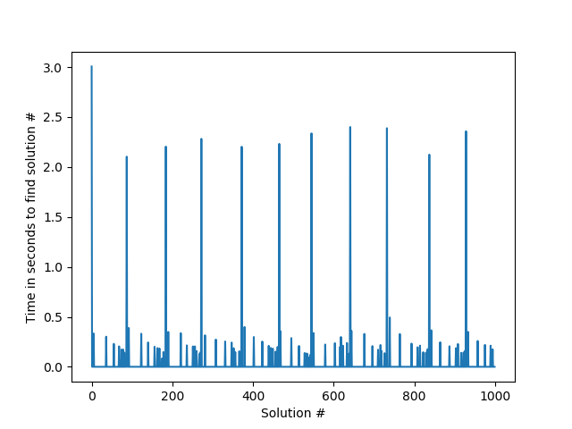
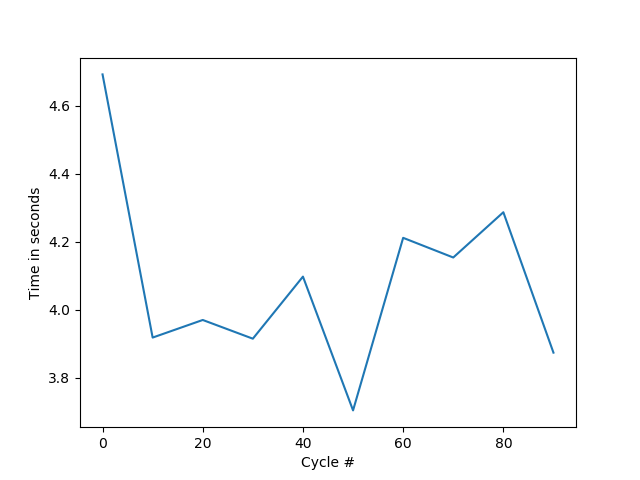

python-bees
---

An implementation of the Artifical Bee Colony algorithm originally proposed by Karaboga

ABC_test.py attempts to reverse a step of a cellular automata using the ABC algorithm. 

The algorithm currently can find around 100 solutions very quickly, ~~but can't find many more.~~ fixed by janky hack, see below. I believe the current main problem is not with the bees, but rather because hamming distance is not great for determing how good a solution is, and also the improvement strategy of flipping one bit at a time can only get so many solutions.

Another big problem is that this application is not what this sort of meta-heuristic is usually used for. Reversing cellular automata requires finding all 10k ish possible steps, while the ABC algorithm is very good at finding one solution out of a large amount. The current janky hack is just to reset the hive every 10 cycles since it finds a large amount of solutions during that short period anyway.

Aside
---

This program is also the stupidest possible way of solving one of the cryptography challenges from googlectf 2019. 

*# EMP= 5 #ONL= 299 #SCT= 296 TOTAL = 600*  
*Kept job= 5 Converted from onl to emp= 0*  
*number of solutions found =  4242 cycle time= 6.870338678359985 current p =  1.0*  
*['CTF{reversing_cellular_automatas_can_be_done_bit_by_bit}\n']*  

Results
---

*Good runs*  
TOTAL TIME FOR 100 SOLUTIONS =  4.619204521179199 FOR RANDOM_GOAL= True  
AVERAGE TIME FOR 10 CYCLES= 3.7850918769836426  
CYCLE COUNT= 15  
STD DEV in solution times= 0.21309670614425877  

TOTAL TIME FOR 100 SOLUTIONS =  5.018507242202759 FOR RANDOM_GOAL= True  
AVERAGE TIME FOR 10 CYCLES= 4.860507488250732  
CYCLE COUNT= 11  
STD DEV in solution times= 0.27361129124608474  

*Long runs*  
TOTAL TIME FOR 1000 SOLUTIONS =  44.38261604309082 FOR RANDOM_GOAL= True  
AVERAGE TIME FOR 10 CYCLES= 4.081832861900329  
CYCLE COUNT= 107  
STD DEV in solution times= 0.25099414065274755  

 
 